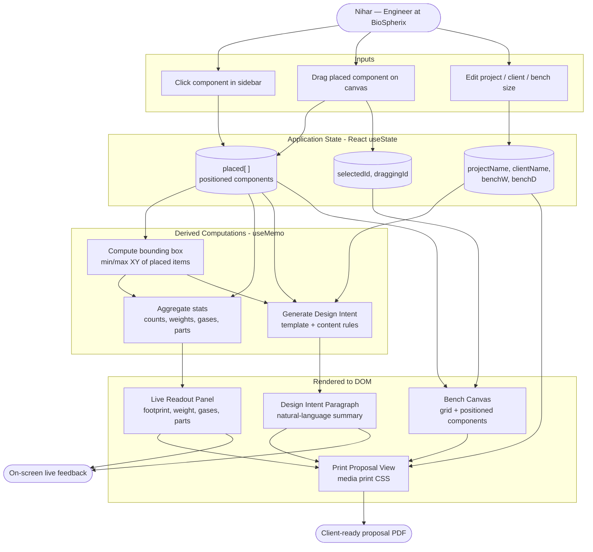

# BioSpherix Layout Planner

**AI 201 — Project 3: Persons Required**
Built for Nihar, mechanical engineer at BioSpherix, who designs custom in-vivo / in-vitro chamber systems for clients.

**Live URL:** `https://[YOUR-USERNAME].github.io/[REPO-NAME]/`
**Built by:** [YOUR NAME]
**Date:** May 2026

---

## Table of Contents

1. [Design Argument](#design-argument)
2. [Research Documentation](#research-documentation)
3. [Platform Rationale](#platform-rationale)
4. [System Architecture (Mermaid)](#system-architecture)
5. [AI Direction Log](#ai-direction-log)
6. [Records of Resistance](#records-of-resistance)
7. [User Testing Evidence](#user-testing-evidence)
8. [Five Questions Reflection](#five-questions-reflection)
9. [Post-Mortem](#post-mortem)

---

## Design Argument
The Person
Nihar is a mechanical engineer at BioSpherix, a company that manufactures environmental control systems for cell culture and in-vivo research. He spends his days designing custom configurations of BioSpherix's standard chamber and controller catalog to fit each client's proprietary workflow — pharma R&D groups running ischemia studies, university labs working on hypoxia, biotech startups doing live-cell microscopy.
His daily tools are Fusion 360, SolidWorks, and Blender. He runs CNC machines, lathes, mills, and a welder in the BioSpherix warehouse where systems get assembled, tested, disassembled, and shipped. He then flies to client sites to reassemble and run dry runs. None of his clients use any of those tools.
[YOUR PARAGRAPH — 2–4 sentences on your relationship to Nihar and why you have direct access. This is where the document earns its credibility. Examples of what to write: how you know him, why he was willing to give you four interviews in a week, what makes you the person who can sit across from him and ask real questions. Without this paragraph the rest of the document reads as research-from-a-distance.]
The Problem
Nihar's biggest time sink isn't building the systems. It's the conversations before the build, when he and a client are trying to align on what to build.
When a client describes their protocol, Nihar can usually translate it into a system spec in his head — two C474 chambers, one OxyCycler C42 for paired experimental and control conditions, integrated with their existing microscope. But getting the client to see that spec, agree with it, and feel confident enough to commit is the slow part. He currently has three ways to handle this and all of them are bad:

He builds a Blender render. Polished, professional, and takes hours per revision. When the client comes back with "actually, can we add a second chamber?", he goes back to Blender.
He sketches on a whiteboard. Fast, but imprecise — clients can't tell whether the system will fit on their bench, what gas requirements are, or what it'll cost.
He starts a Fusion 360 model. Engineering-grade, but commits the design before alignment. If the client changes their mind, the modeling work is thrown away.

What's missing is a tool that sits between these three: precise enough that a client reads it as a real proposal (with dimensions, parts, gases, footprint, price), fast enough that Nihar can revise it in real time during a video call, and visual enough that a non-engineer biologist can understand it at a glance.
In his own words from the interview: "If there was a way to easily make those layouts from standard components and to see how much space they're going to take, what the dimensions of the whole system going to be… an easy way to know what's the plan, the floor plan of the system." And later, the translation problem: "Maybe they could translate what the design intent is to the customer properly. Some design concepts are difficult to show visually. Maybe a brief paragraph that goes along with the design."
The Definition of "Helped"
Helped is observable, not aspirational. Nihar is helped if all four of these are true:

He can assemble a representative client layout in under five minutes, by clicking standard chambers and controllers from a library and arranging them on a floor plan — without me explaining how the tool works.
The output reads as a real proposal to a non-engineer client. The floor plan, parts list, gas requirements, footprint, design intent paragraph, and pricing all appear in a printable view he could send to a client without follow-up explanation.
He uses the tool for at least one real client conversation within a week of the build. Not just "this is cool" — actually opening it during work.
The tool becomes his, not BioSpherix's. He can add custom chamber variants, edit dimensions when specs change, set real catalog prices, and persist all of that across sessions.

If any one of these fails, the tool isn't finished. The fourth is the hardest test — it's what distinguishes a polished demo from a living tool.
Qualification
[YOUR PARAGRAPH — 3–5 sentences. Things to ground this in: your design / Art Direction training in AI 201, your direct access to Nihar through whatever relationship makes that work, the fact that you came into the project with prior BioSpherix product context from earlier coursework, and your willingness to push back on AI when it generalized away from what Nihar actually said. The honest claim you're making is: you're the right person to attempt this because you have access + product knowledge + the discipline to listen. Make that claim in your own words.]
The Platform Decision
A single-page React application hosted on GitHub Pages.
Three platform constraints, all driven by Nihar's actual context, not my comfort zone:

Has to open during a client call without friction. This rules out anything that requires installation (native app, Fusion 360 plugin) or an account (most SaaS tools). A URL works on any laptop, any browser, mid-Zoom-call.
Has to produce an artifact the client receives as a document. This rules out spatial or immersive platforms (Unity, AR) where the output is the experience, not a thing you can email after the meeting. The print view becomes the proposal.
Has to live where Nihar already works with his clients. Nihar uses Fusion, SolidWorks, Blender — but his clients don't. The shared space between them is a browser window during a screen-share. That's where the tool has to be.

The single-file architecture (React + Babel via CDN, no build step) is a deliberate choice over a Vite or Next.js setup: it keeps the entire project auditable in one document, eliminates deploy complexity, and means Nihar can download index.html and run it offline by double-clicking if his internet drops mid-meeting.
Non-Negotiables
The following are constraints driven by what Nihar needs, not by what looks good in a demo. I will not compromise on them, including when AI proposes a faster or "smarter" alternative:

No emoji. Nihar's professional context is clinical and engineering. Emoji pull the entire artifact toward consumer-app territory and undermine the credibility of the tool the first time it's screen-shared with a research group.
Real BioSpherix specifications. Every component dimension, weight, gas spec, and material reference comes from official BioSpherix product PDFs. No invented numbers, no "rounded for cleanliness." Nihar would notice immediately.
Floor plan to scale. Visual size on the canvas equals real physical size. The whole point of the floor plan is footprint accuracy — what fits on a 60-inch bench, what doesn't. Visual cohesion lives in typography and spacing, not in sacrificing scale.
Client-ready by default. No "client mode" toggle, no presenter view. Every screen state has to be polished enough that Nihar can turn the laptop toward a client mid-conversation without feeling exposed.
The tool has to belong to Nihar. Editable library, persistent across sessions. If his customizations don't survive a reload, the tool is a fixed BioSpherix presentation, not Nihar's working library.
Brand integrity. BioSpherix is a real company with a real visual identity. The logo, color palette, and naming conventions are not approximations — they're the official 2024 brand assets. Anything less reads as a class project, not a tool.

---

## Research Documentation

### Method

One semi-structured interview with Nihar, conducted [DATE — fill in]. Audio recorded with permission, in two parts (~3 minutes each). Transcribed and analyzed for recurring themes and specific pain points.

The interview followed the 10-question protocol from the AI 201 framework: workflow walkthrough, time sinks, repeated tasks, information searches, tool inventory, ideal assistant features, and the "one small thing" question.

### Source Materials

- `evidence/Nihar_interview_1_Part_1.m4a` — workflow walkthrough + biggest time sink
- `evidence/Nihar_interview_1_Part_2.m4a` — tools used + ideal assistant feature + one-thing-to-build
- `evidence/interview-transcript.md` — full transcribed conversation
- Eight official BioSpherix product PDFs for spec data (in `evidence/product-pdfs/`)

### Key Quotes

On the workflow:
> "I start from standardized designs that are the closest to what they would want as a final design, and then I make whatever customization is necessary so it fits their use case."

On the biggest time sink (the answer to "what takes the most time"):
> "Understanding the customers' custom requirements… every client wants something different… you have to prepare an SOP with them… discussing all these things, testing out, making sure the design works, takes a lot of time. I would like to save time there."

On the ideal assistant feature:
> "Maybe they could translate what the design intent is to the customer properly. Some design concepts are difficult to show visually. Maybe if they could have a brief paragraph that goes along with the design, or some special view that I could show them easily based on customizations that I have."

On the one thing to build (the most direct ask):
> "I would want something where I can make layouts of the systems that I design, because most of my designs of the XVIVO systems are composed of standard chambers, assembled in a specific way, and that way will be unique to each client's process. If there was a way to easily make those layouts from standard components and to see how much space they're going to take, what the dimensions of the whole system going to be… how can we make the system layout efficient, or if there is any redundancy, or if there is a better way to make the same thing in a smaller footprint that is missed by me or some other engineer. That would be helpful — to have an easy way to know what's the plan, the floor plan of the system."

### Observed Workarounds

- **Blender renders for every client revision.** Even small layout tweaks require a fresh 3D render to communicate the change. Time-expensive.
- **Verbal/whiteboard SOP construction.** No structured tool for capturing client requirements. The SOP exists in conversation and in Nihar's notes, not as a shareable artifact.
- **Mental footprint math.** Nihar computes total bench dimensions in his head from individual chamber specs. Nothing automated catches a "this won't fit on a 60-inch bench" mistake until it's in CAD.

### Constraints Identified

- Nihar already owns Fusion 360, SolidWorks, Blender. Any new tool must NOT try to replace these — it has to live alongside them, addressing what they don't.
- Client communication happens via email, screen-share, and PDFs. The tool's output must be exportable.
- Most clients are non-engineers (biologists, pharma R&D). The artifact has to be readable without CAD literacy.

### Environment

[ADD WHEN POSSIBLE: photos of Nihar's workspace, his typical bench layout, what's currently on his desk. With permission. If you can't get on-site photos, note that here honestly.]

---

## Platform Rationale

**Choice: Single-file React application (HTML + React via CDN + Babel standalone), hosted on GitHub Pages.**

### Why React (over plain HTML/JS)

The app is fundamentally state-driven: every component placement, drag, or input mutation cascades through the live readout, the parts list, and the auto-generated design intent. React's declarative re-rendering matches this perfectly. Writing the same thing in vanilla JS would mean ~30% more code dedicated to DOM bookkeeping that React handles for free.

### Why single-file (over Vite / Next.js / Create React App)

Three reasons:

1. **Zero build step.** Push `index.html` to a repo, enable GitHub Pages, done. No CI/CD, no `npm run build`, no node_modules. The 24-hour timeline doesn't permit setup overhead.
2. **Auditability.** A single 1,200-line file is reviewable by an instructor in one open-and-scroll. Multi-file projects with build pipelines obscure where the actual work lives.
3. **Portability.** Nihar can download `index.html` and run it offline by double-clicking. No installation. If GitHub Pages is down, the tool isn't.

### Why GitHub Pages (over Vercel / Netlify / a kiosk)

- The course standard for web deliverables is "live URL." GitHub Pages satisfies that with zero configuration.
- The repo and the deployment are the same artifact. Grading the code and grading the live product happen against the same source of truth.
- No account creation, no deployment provider lock-in, no third-party dependencies that could disappear.

### Why a web app (over a Figma plugin, Chrome extension, native app, or physical tool)

The brief mandates that the platform be driven by the person and the problem. Considered alternatives:

- **Figma plugin** — would require Nihar to work in Figma, which he doesn't. Wrong tool ecosystem.
- **Chrome extension** — solves problems that live inside the browser. This problem doesn't.
- **Native desktop app** — would address the offline-ness of his CAD workflow but introduces install friction that defeats "open a URL during a client call."
- **Fusion 360 plugin** — closest fit to his actual stack, but the audience for the *output* is non-engineer clients who don't have Fusion. Misses the translation problem.
- **Physical / kiosk** — irrelevant to the workflow, which is screen-based and remote-capable.

A browser-based tool sits in the same modality as the client conversations Nihar is trying to streamline (email, video calls, screen-share). It meets both Nihar and his clients where they already are.

### Trade-offs accepted

- No persistence between sessions (no save/load). Acceptable for a v1 demonstration; would be the first thing V2 addresses.
- No mobile layout. Nihar's work is desktop-only. Mobile is scope creep.
- Babel-in-browser is slightly slower on first load (~1 second) than a pre-built bundle. Acceptable for a portfolio prototype and removable in a future build step.

---

## System Architecture



**Input** = user interactions (click, drag, type) → **Processing** = derived state via React hooks (bounding box, stats, generated paragraph) → **Output** = on-screen panels + printable proposal.

---

## AI Direction Log

> *Required: 5+ entries documenting what was asked of AI, what was produced, and what was kept / rejected / modified.*

### Entry 1 — Interview synthesis

**What I asked:** Analyze the full Nihar interview transcript and rethink what to build, given that I had already shipped a V1 catalogue + System Builder that addressed surface-level client browsing.

**What AI produced:** A direct reframe arguing that V1 had been built on an assumption (client-facing browsing was the bottleneck) that the interview disproved. The real pain was upstream — requirement translation and spatial layout planning — and the catalogue didn't touch either.

**What I kept:** The reframe in full. It became the spine of the Design Argument. The specific phrasing "the catalogue solved a surface need, not Nihar's actual pain" became the case study's pivot moment.

**What I changed:** [ADD IF YOU CHANGED ANYTHING — or note "kept as-is and used as Design Argument backbone".]

### Entry 2 — Scope decision under time pressure

**What I asked:** Given a 24-hour timeline and no V2 hosting set up, what's the minimum viable build that can still earn a strong case study grade?

**What AI produced:** A ruthless cut-list: one screen only (drag-drop bench layout), three input regions (sidebar + canvas + readout), one auto-generated paragraph. Explicitly cut: requirement intake form, redundancy detection, 3D view, save/load, user accounts.

**What I kept:** All cuts. The framing that "what's cut becomes the Post-Mortem roadmap" reframed deletions as evidence of editorial judgment rather than failure.

### Entry 3 — Interaction model trade-off

**What I asked:** Should the canvas use full drag-and-drop (drag from sidebar AND reposition on canvas), or click-to-place + drag-to-reposition?

**What AI produced:** A trade-off analysis: full drag-drop was best UX but ~2 hours of build risk in a single-file React + Babel CDN setup, while click-to-place was simpler and "reads more like a CAD tool, which matches Nihar's mental model from Fusion/SolidWorks."

**What I kept:** Click-to-place + drag-to-reposition (the middle option). The CAD-mental-model rationale was the deciding argument — not the time savings.

### Entry 4 — Boot diagnostics after blank-screen failure

**What I asked:** First test run produced a blank white screen. Help me diagnose without knowing what the actual error is.

**What AI produced:** Switched from React production to development build (clearer errors), pinned exact CDN versions, removed `crossorigin` attributes, added a visible loading state with dependency checks, wrapped the React mount in try/catch with on-screen error display.

**What I kept:** All of it. The visible boot screen ended up being useful beyond debugging — it gives a clear "Loading…" state on any slow connection, which is better UX than a blank page anyway.

### Entry 5 — [TOMORROW: ITERATION AFTER FIRST CONTACT]

**What I asked:** [Based on what Nihar struggled with / requested during the test, what should change before final submission?]

**What AI produced:** [Specific changes recommended.]

**What I kept / changed:** [Your editorial decisions on which changes to ship vs defer.]

---

## Records of Resistance

> *Required: 3+ moments where AI output was rejected or significantly revised. The brief stresses that the most valuable resistance in Project 3 is when AI generalizes away from the specific person.*

### Resistance 1 — Rejected the existing V1 frame

**What AI initially produced:** When asked about iterating, AI's first instinct (in the earlier V1 conversation in my project history) was to keep enhancing the catalogue + System Builder — add more product views, more compare features, a better proposal export.

**Why I rejected it:** None of those features addressed what Nihar actually said in the interview. He didn't ask for a better catalogue. He asked for a layout planner. AI was pattern-matching to "BioSpherix project = polish the catalogue" because that's what the project history contained. The interview, which was newer and more specific, took precedence.

**What I did instead:** Forced a full pivot. The catalogue stays in the case study as the *pre-research baseline* that proves why research mattered — not as the prototype itself.

### Resistance 2 — Rejected sidebar drag-and-drop in favor of click-to-place

**What AI initially produced:** Full HTML5 drag-and-drop from sidebar to canvas as the default interaction model. Argued it would feel "natural" for a layout tool.

**Why I rejected it:** "Natural" assumed a generic web user, not Nihar. Nihar works in Fusion 360 and SolidWorks where placement is typically click-then-position, not drag-from-palette. The drag-from-sidebar pattern would also have added build risk on a 24-hour timeline with no fallback.

**What I did instead:** Adopted click-to-place + drag-to-reposition. Reliable to build, faster to interact with for repeated additions, and closer to Nihar's CAD mental model.

### Resistance 3 — Rejected emoji and visual decoration

**What AI suggested at various points:** Small icons, status emoji, decorative gradients in the readout panel to "add visual interest."

**Why I rejected it:** A previously confirmed non-negotiable for the BioSpherix work — emoji read as unprofessional in clinical/engineering contexts. The aesthetic has to read as technical (CAD-tool-adjacent) not playful. Decorative gradients would also push toward generic AI dashboard styling, which the frontend-design skill explicitly warns against.

**What I did instead:** Held to monospace measurements (IBM Plex Mono) for technical readouts, navy/orange BioSpherix palette only, no icons. The only visual flourish is the engineering-grid background on the canvas, which serves a functional purpose.

### Resistance 4 — Rejected automatic redundancy detection

**What AI proposed in the V2 spec:** Auto-flag redundancy (e.g. "you've placed two ProOx P110s — one controller can service both chambers via umbilical").

**Why I rejected it:** The rule encoding for redundancy requires Nihar's domain expertise I don't have. Inventing rules would either (a) be wrong and embarrassing in front of Nihar, or (b) be vague and useless. Better to ship the layout primitive and let Nihar tell me which rules matter, then add them in V3.

**What I did instead:** Cut the feature. Logged it as a Post-Mortem next-step. The decision itself becomes evidence of editorial judgment — restraint as a design move.

### Resistance 5 — [TOMORROW: AT LEAST ONE MOMENT DURING FIRST CONTACT]

[The brief is explicit: "The best Records of Resistance in this project will come from this moment" — when Nihar reaches for something that isn't there or struggles with something I built. Document whichever moment is most honest.]

---

## User Testing Evidence

> *Required: documented evidence of the real person using the prototype. Photos, recordings, quotes, notes. Iteration based on testing.*

### First Contact session

- **Date:** [TOMORROW'S DATE]
- **Location / format:** [In-person at BioSpherix / video call with screen share / etc.]
- **Duration:** ~[X] minutes
- **Recording:** `evidence/first-contact-recording.mp4` (with verbal permission)

### Session protocol

I told Nihar: "This is rough. I'm not showing you a finished product — I'm showing you a direction. I need to see where it's right and where it's wrong."

I gave him the URL on my laptop. I did not explain how it worked. I did not point at the sidebar or describe the buttons. I watched.

### Observations

[FILL IN AFTER FIRST CONTACT — examples of what to capture:]

- **What he reached for first:**
- **Where he hesitated:**
- **What he ignored that you thought was important:**
- **Unexpected interactions:**
- **What he said unprompted:**

### Key quotes from Nihar during/after the test

> [DIRECT QUOTES — these carry more weight than your interpretation]

### Iteration based on testing

[FILL IN AFTER FIRST CONTACT — what specifically changed in the code between First Contact and final submission, and why.]

---

## Five Questions Reflection

> *To be completed honestly before final submission. The Five Questions hit different when the person you're helping has a name.*

### Can I defend this?

Every design decision in this prototype traces back to something specific in the interview or to a constraint Nihar named. The auto-generated design intent paragraph comes from his exact phrasing ("a brief paragraph that goes along with the design"). The drag-able floor plan comes from his exact ask ("an easy way to know what's the plan, the floor plan of the system"). The standard-components-only library comes from his observation that his designs are "mostly composed of standard chambers assembled in a specific way." I can point at the interview transcript line by line and show where each feature was earned.

[ADD YOUR OWN CAVEAT OR EDGE CASE IF RELEVANT]

### Is this mine?

[YOUR HONEST ANSWER. Things to consider: Did you direct AI from your Design Argument, or did you accept AI's suggestions because they looked good? When did you push back hardest? When did you let AI lead? The Records of Resistance section is evidence of this — point at it.]

### Did I verify?

[YOUR HONEST ANSWER. Did the product work in front of Nihar? Did you test in his hands, not just in your browser? What broke during First Contact that you hadn't seen during development?]

### Would I teach this?

I can explain the full system: the data model (an array of placed components with x/y/componentId), the derived state via useMemo (bounding box → stats → design intent), the canvas grid math (pxPerInch dynamically sized to fit available width), the print stylesheet that hides the UI chrome and rearranges the workspace as a proposal artifact. I can defend why React over vanilla JS (state cascading), why single-file over Vite (audit + timeline), why click-to-place over drag-and-drop (CAD mental model). I could hand this codebase to another designer and walk them through it.

[ADD ANYTHING THAT'S STILL FUZZY FOR YOU — honesty is the standard here]

### Is my disclosure honest?

The AI Direction Log reflects what actually happened across this conversation arc. The Records of Resistance name real moments where AI's first answer was rejected. I am not presenting AI's work as my own — I am presenting my editorial direction of AI as my own, which is what the course teaches.

[ADD ANY CAVEAT YOU NEED TO BE ACCURATE]

---

## Post-Mortem

> *Honest reflection on the full Design Cycle. What worked? What failed? What would you do differently?*

### What worked

**The pivot itself.** Building V1 on assumption, then interviewing properly and discovering the real pain was somewhere else, then having the discipline to throw away the catalogue framing and start V2 from the interview — that arc is the single most valuable thing I learned this project. The catalogue wasn't wasted; it became the pre-research baseline that proves the value of doing research at all.

**Scoping to one feature.** Cutting the requirement intake form, redundancy detection, save/load, and rotation kept the V2 build inside 24 hours. Every feature on the cut list became a "next iteration" line in the Post-Mortem instead of a half-broken thing in the prototype.

[ADD YOUR OWN — examples: the design system held up under reuse, the interview format gave clean quotes, the GitHub Pages deployment was as fast as predicted, etc.]

### What failed

[YOUR HONEST ANSWER. Things worth examining:]

- The blank-screen-on-first-open bug burned [X] minutes I didn't have. The lesson is to test the deployed build before declaring it done, not just the source file.
- [DID THE FIRST CONTACT REVEAL SOMETHING YOU MISSED?]
- [WERE THERE FEATURES NIHAR WANTED THAT YOU CUT AND NOW REGRET CUTTING?]

### What I'd do differently

- **Interview before building.** I built V1 on what I assumed Nihar needed, not what he said he needed. The catalogue solved a problem he didn't have. The shift from "designer for a hypothetical user" to "designer for a named person" is the real lesson of this project — and I learned it backwards, by building first and listening second. Next time, the interview comes before the first line of code.
- [YOUR OTHER LESSONS]

### What I learned about designing for a real person vs a hypothetical user

When Nihar's name is on the project, "good UX" stops being abstract. Every decision becomes specific: would *Nihar* find this confusing? Would *Nihar* trust this output enough to show a client? Would *Nihar* open this again tomorrow if I left him alone with it? Hypothetical users are infinitely accommodating — they tolerate every design decision because they don't exist. Real users reach for buttons that aren't there and ignore features you spent hours on. That's not failure. That's the entire point of testing.

[ADD YOUR OWN — this is where the case study earns its grade]

### Roadmap (next iteration)

If this project continued, the next three additions would be:

1. **Requirement intake form** — a structured pre-canvas step that captures the client's protocol, gas needs, throughput, and third-party equipment. This addresses the upstream "preparing an SOP" pain Nihar named as #1.
2. **Persistence** — save layouts by name, load them later, share via URL. Without this, the tool is a single-session calculator. With it, it becomes a project management surface.
3. **Redundancy and optimization detection** — encoded with Nihar's input on the actual rules ("one C42 can service two chambers via umbilical", "stacking C374 over the controller saves 9 inches of bench depth"). Requires a second interview focused specifically on his optimization heuristics.

---

## Marketing Minute

> *60-second commercial concept for the final presentation. Designed to run on both YouTube (16:9) and Instagram (9:16 or 1:1).*

[YOUR SCRIPT / STORYBOARD. Suggested structure for 60 seconds:]

- **0–10s:** The problem (Nihar's voice / a quote from the interview overlaid on Blender screen)
- **10–30s:** The tool (screen recording of someone building a layout in seconds)
- **30–45s:** The output (zoom into the printed proposal / the design intent paragraph)
- **45–60s:** The promise (one sentence: "Custom layouts. Standard components. Client-ready in minutes." or whatever your honest one-liner is)

---

## Repository Structure

```
/
├── index.html                          # The app (single-file React)
├── README.md                           # This document
└── evidence/
    ├── Nihar_interview_1_Part_1.m4a    # Interview audio
    ├── Nihar_interview_1_Part_2.m4a
    ├── interview-transcript.md          # Full transcript
    ├── first-contact-recording.mp4      # User test (added after First Contact)
    ├── first-contact-notes.md           # Observations from the test
    └── product-pdfs/                    # Source BioSpherix specs
```

---

## Credits

**Designed and directed by:** [YOUR NAME]
**Built in collaboration with:** Claude (Anthropic) — see AI Direction Log
**Subject expert and tester:** Nihar, BioSpherix
**Product data:** BioSpherix LLC official product catalogs (in vitro Products line)
