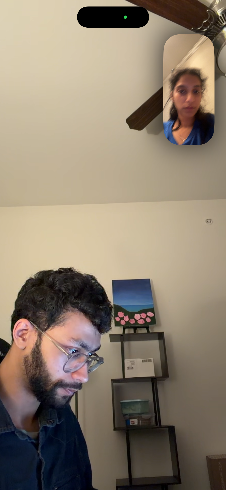
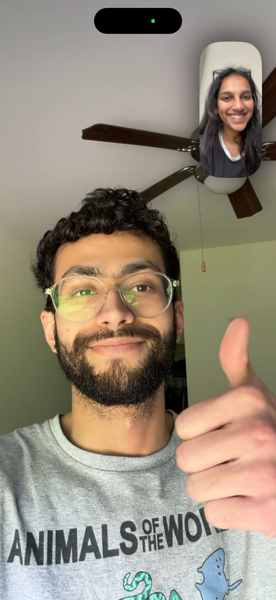
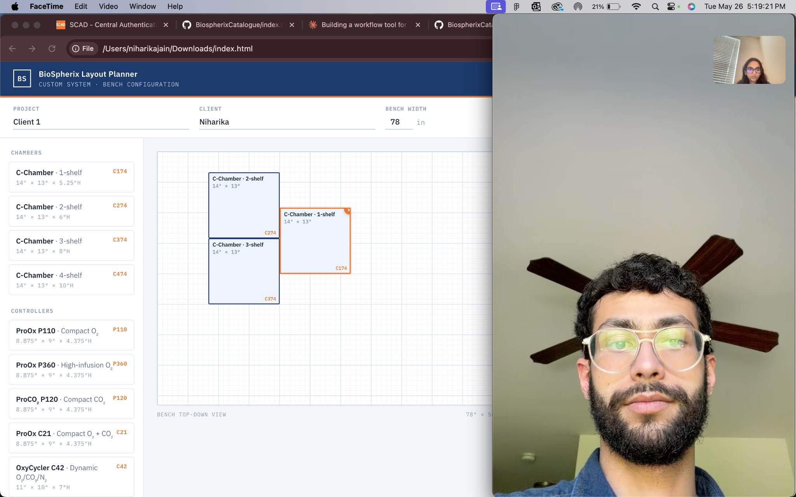
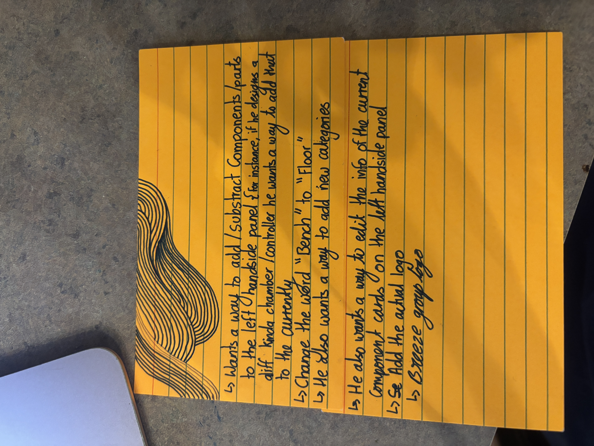
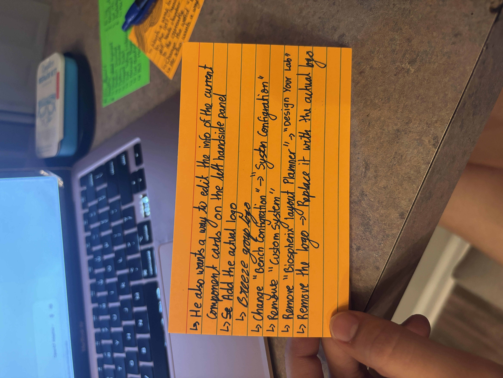
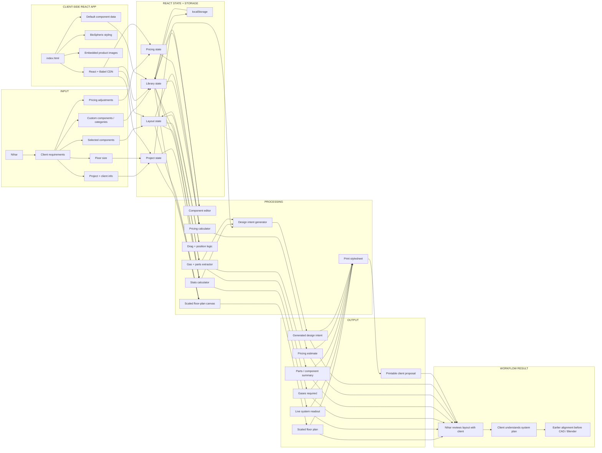

# Design Your Lab — A Layout Planner for BioSpherix

**AI 201 · Project 3: Persons Required**

**Built for Nihar · Mechanical Engineer, BioSpherix**

**Live URL:** https://niharika12002.github.io/BiospherixCatalogue/

**Repo:** https://github.com/Niharika12002/BiospherixCatalogue

---

## Table of Contents

1. [Design Argument](#design-argument)
2. [Research Documentation](#research-documentation)
3. [Platform Rationale](#platform-rationale)
4. [Shipped Product](#shipped-product)
5. [Iteration Arc — V1 through V7](#iteration-arc--v1-through-v7)
6. [User Testing & Evidence](#user-testing--evidence)
7. [Marketing Minute](#marketing-minute)
8. [AI Direction Log](#ai-direction-log)
9. [Records of Resistance](#records-of-resistance)
10. [Five Questions Reflection](#five-questions-reflection)
11. [Post-Mortem](#post-mortem)
12. [System Architecture (Mermaid)](#system-architecture)

---

## Design Argument

> *Written before AI engagement. This is the thesis the project is evaluated against.*

### The Person

Nihar is a mechanical engineer at BioSpherix, a company that manufactures environmental control systems for cell culture and in-vivo research. He spends his days designing custom configurations of BioSpherix's standard chamber and controller catalog to fit each client's proprietary workflow — pharma R&D groups running ischemia studies, university labs working on hypoxia, biotech startups doing live-cell microscopy.

His daily tools are Fusion 360, SolidWorks, and Blender. He runs CNC machines, lathes, mills, and a welder in the BioSpherix warehouse where systems get assembled, tested, disassembled, and shipped. He then flies to client sites to reassemble and run dry runs. None of his clients use any of those tools.

Nihar is a good friend, which is the reason this project exists in the form it does. Friendship gave me access — four interviews in a week, the latitude to push back on his answers and ask follow-up questions, and the trust to put rough prototypes in front of him without an explanation prepared. That access isn't a small thing for a four-week project. Most "design for a real person" assignments stall at the research stage because the person being designed for has no incentive to keep showing up. Nihar showed up because he wanted to.

### The Problem

Nihar's biggest time sink isn't building the systems. It's the conversations *before* the build, when he and a client are trying to align on what to build.

When a client describes their protocol, Nihar can usually translate it into a system spec in his head — *two C474 chambers, one OxyCycler C42 for paired experimental and control conditions, integrated with their existing microscope*. But getting the client to *see* that spec, agree with it, and feel confident enough to commit is the slow part. He currently has three ways to handle this and all of them are bad:

1. **He builds a Blender render.** Polished, professional, and takes hours per revision. When the client comes back with "actually, can we add a second chamber?", he goes back to Blender.
2. **He sketches on a whiteboard.** Fast, but imprecise — clients can't tell whether the system will fit on their bench, what gas requirements are, or what it'll cost.
3. **He starts a Fusion 360 model.** Engineering-grade, but commits the design before alignment. If the client changes their mind, the modeling work is thrown away.

What's missing is a tool that sits between these three: precise enough that a client reads it as a real proposal (with dimensions, parts, gases, footprint, price), fast enough that Nihar can revise it in real time during a video call, and visual enough that a non-engineer biologist can understand it at a glance.

In his own words from the interview:

> *"If there was a way to easily make those layouts from standard components and to see how much space they're going to take, what the dimensions of the whole system going to be… an easy way to know what's the plan, the floor plan of the system."*

And later, the translation problem:

> *"Maybe they could translate what the design intent is to the customer properly. Some design concepts are difficult to show visually. Maybe a brief paragraph that goes along with the design."*

### The Definition of "Helped"

Helped is observable, not aspirational. Nihar is helped if all four of these are true:

1. **He can assemble a representative client layout in under five minutes**, by clicking standard chambers and controllers from a library and arranging them on a floor plan — without me explaining how the tool works.
2. **The output reads as a real proposal to a non-engineer client.** The floor plan, parts list, gas requirements, footprint, design intent paragraph, and pricing all appear in a printable view he could send to a client without follow-up explanation.
3. **He uses the tool for at least one real client conversation within a week of the build.** Not just "this is cool" — actually opening it during work.
4. **The tool becomes his, not BioSpherix's.** He can add custom chamber variants, edit dimensions when specs change, set real catalog prices, and persist all of that across sessions.

If any one of these fails, the tool isn't finished. The fourth is the hardest test — it's what distinguishes a polished demo from a living tool.

### Qualification

I'm the right person to attempt this because I have three things AI doesn't: direct access to Nihar, prior context on his work, and the discipline to listen before building. The access is the friendship. The context is that I already knew where he worked and roughly what BioSpherix made before this project started, which meant the first interview wasn't spent explaining the company — it was spent on his actual pain points. The discipline is what I learned in AI 201: every time AI generalized away from what Nihar specifically said, my job was to pull it back. The clearest example is when AI's pattern-matching pushed me toward a catalogue browser early on, and the interview revealed Nihar actually needed a layout planner. The case study documents several more. The Art Director's authority in this project comes from understanding the person, not from technical skill — and on that dimension I had the unfair advantage of already knowing him.

### The Platform Decision

A single-page React application hosted on GitHub Pages.

Three platform constraints, all driven by Nihar's actual context, not my comfort zone:

- **Has to open during a client call without friction.** This rules out anything that requires installation (native app, Fusion 360 plugin) or an account (most SaaS tools). A URL works on any laptop, any browser, mid-Zoom-call.
- **Has to produce an artifact the client receives as a document.** This rules out spatial or immersive platforms (Unity, AR) where the output *is* the experience, not a thing you can email after the meeting. The print view becomes the proposal.
- **Has to live where Nihar already works *with* his clients.** Nihar uses Fusion, SolidWorks, Blender — but his clients don't. The shared space between them is a browser window during a screen-share. That's where the tool has to be.

The single-file architecture (React + Babel via CDN, no build step) is a deliberate choice over a Vite or Next.js setup: it keeps the entire project auditable in one document, eliminates deploy complexity, and means Nihar can download `index.html` and run it offline by double-clicking if his internet drops mid-meeting.

### Non-Negotiables

The following are constraints driven by what Nihar needs, not by what looks good in a demo. I will not compromise on them, including when AI proposes a faster or "smarter" alternative:

- **No emoji.** Nihar's professional context is clinical and engineering. Emoji pull the entire artifact toward consumer-app territory and undermine the credibility of the tool the first time it's screen-shared with a research group.
- **Verified BioSpherix specifications where available.** Component dimensions, weights, gas specs, and material references are pulled from BioSpherix product material where available. Pricing is treated as editable estimate data, not final internal quote data. If a value is uncertain, the tool should make that clear instead of pretending it is official.
- **Floor plan to scale.** Visual size on the canvas equals real physical size. The whole point of the floor plan is footprint accuracy — what fits on a 60-inch bench, what doesn't. Visual cohesion lives in typography and spacing, not in sacrificing scale.
- **Client-ready by default.** No "client mode" toggle, no presenter view. Every screen state has to be polished enough that Nihar can turn the laptop toward a client mid-conversation without feeling exposed.
- **The tool has to belong to Nihar.** Editable library, persistent across sessions. If his customizations don't survive a reload, the tool is a fixed BioSpherix presentation, not Nihar's working library.
- **Brand integrity.** BioSpherix is a real company with a real visual identity. The logo, color palette, and naming conventions need to feel aligned with BioSpherix / Breeze Group rather than generic startup branding. Anything less reads as a class project, not a tool.

---

## Research Documentation

This project was built through direct research with Nihar, a mechanical engineer at BioSpherix. The research included multiple recorded interviews, prototype review calls, workflow questions, and feedback sessions where he reviewed the tool as it developed.

The goal was not to design a general BioSpherix catalog. The goal was to understand what Nihar specifically needs in his day-to-day work when translating client requirements into system layouts.

### The Research-Before-Build Failure (and Recovery)

The honest version of this project begins with a mistake: I built a BioSpherix catalogue + System Builder before I had done proper user research. That V1 prototype was based on what *I* assumed Nihar's pain was — that clients struggled to browse and configure BioSpherix products, so a better catalogue would help him sell.

The first interview revealed that assumption was wrong. BioSpherix already has product catalogues. What Nihar needed wasn't another way to show products — it was a faster way to *arrange* them into a custom system layout he could share with a client.

That moment forced a full pivot from a product browser to a layout planner. V1 didn't get thrown away — it became the **pre-research baseline** that documents why research matters. The rest of this section is what I learned once I started listening instead of building.

### Research Method

The research process used:

- A 10-question structured interview about Nihar's workflow, tools, time sinks, and ideal assistant features
- Audio-recorded interviews with permission, transcribed and analyzed for recurring themes
- Follow-up FaceTime conversations to clarify what kind of tool would actually save him time
- Live prototype review sessions while the app was being built (V2 through V7)
- Handwritten feedback notes from Nihar after each prototype review
- Eight official BioSpherix product PDFs used for specification accuracy

### Research Evidence

*Early FaceTime research call with Nihar during the workflow interview process.*

*Follow-up research conversation with Nihar while clarifying what the tool needed to do.*

*Nihar reviewing the working prototype during a live call. The screen shows the component library, scaled layout canvas, and early BioSpherix-style interface.*

*Handwritten feedback notes from Nihar's prototype review. These notes include requests for adding and removing components, changing "Bench" to "Floor," adding new categories, editing component cards, and using the real BioSpherix / Breeze Group logo.*

*Second round of feedback notes showing naming, branding, and component-library changes, including changing "Bench Configuration" to "System Configuration" and renaming the app to "Design Your Lab."*

### Key Interview Quotes

On the workflow:
> "I start from standardized designs that are the closest to what they would want as a final design, and then I make whatever customization is necessary so it fits their use case."

On the biggest time sink:
> "Understanding the customers' custom requirements… every client wants something different… you have to prepare an SOP with them… discussing all these things, testing out, making sure the design works, takes a lot of time. I would like to save time there."

On the ideal assistant feature:
> "Maybe they could translate what the design intent is to the customer properly. Some design concepts are difficult to show visually. Maybe a brief paragraph that goes along with the design, or some special view that I could show them easily based on customizations that I have."

On the one thing he'd build:
> "I would want, like, a way to make layouts of the systems that I design… If there was a way to easily make those layouts from standard components and to see how much space they're going to take, what the dimensions of the whole system going to be… how can we make the system layout efficient, or if there is any redundancy, or if there is a better way to make the same thing in a smaller footprint that is missed by me or some other engineer. That would be helpful — to have an easy way to know what's the plan, the floor plan of the system."

### Interview Insights

#### Insight 1: Nihar's work begins with translation

Nihar's job is not just to design equipment. A major part of his work is translating what a client describes into a system configuration that can actually be built. Clients explain their research workflow, experiment, or lab setup, and Nihar has to turn that into chambers, controllers, gases, dimensions, and a physical arrangement.

This matters because the client is not usually thinking like a mechanical engineer. They may understand the science, but not the physical layout or engineering requirements of the system. The tool therefore needed to help Nihar *explain* a design, not just assemble one. This is why the app includes a generated design intent paragraph and a print-ready proposal view, not only a visual layout canvas.

#### Insight 2: The slowest part is aligning before the real build

Nihar already has professional tools — Fusion 360, SolidWorks, Blender. The problem is that those tools are too detailed too early in the process. If he makes a polished render or CAD model before the client is aligned, every change becomes expensive.

He described needing a faster layout step *before* committing to detailed modeling. This became the core direction of the project: a layout planner that sits between a rough conversation and a final engineering model.

#### Insight 3: The tool needs to be editable because Nihar's work is custom

A fixed product catalog would not be enough. Nihar often works with custom chamber types, controller combinations, and client-specific requirements. During feedback, he specifically asked for the ability to add, subtract, and edit components in the left-side component panel.

From the feedback notes:
> "Wants a way to add/subtract components/parts to the left-hand side panel. For instance, if he designs a different kind of chamber/controller, he wants a way to add that."

This changed the project from a static BioSpherix catalog into a tool Nihar can keep adapting as his work changes. It's also what eventually justified building the V7 library editor with localStorage persistence — without persistence, every reload would wipe his customizations and the feature would be demo-only.

#### Insight 4: Language matters because this is a professional engineering context

Nihar's feedback showed that small wording choices affect whether the tool feels professional and accurate. He asked to change "Bench" to "Floor," because the system is not always limited to a bench setup. He also asked to change "Bench Configuration" to "System Configuration," which better matches the way he thinks about complete BioSpherix setups.

Specific feedback notes:

- Change "Bench" to "Floor"
- Change "Bench Configuration" to "System Configuration"
- Remove "Custom System"
- Rename "BioSpherix Layout Planner" to "Design Your Lab"
- Add the actual BioSpherix / Breeze Group logo
- Add a way to edit current component card information
- Add a way to create new categories

These weren't visual polish requests. They were signs the tool needed to feel like something that could belong in his real workflow.

### Observed Pain Points

1. **Existing tools are too slow for early client alignment.** Blender and CAD are useful once direction is clear, but too slow for quick client revisions. A chamber-count change or footprint adjustment can mean hours of rework.

2. **Whiteboard sketches are fast but not client-ready.** Sketching helps during conversation but doesn't produce a polished artifact. It doesn't clearly show scale, dimensions, components, gas needs, or proposal language.

3. **Clients need visual clarity.** BioSpherix clients are scientists, researchers, or lab teams. They understand their protocol but not the mechanical arrangement. The layout tool makes the system visible and easier to discuss.

4. **Nihar needs control over the component library.** Because his work changes from client to client, the component library cannot be locked. He needs to add parts, edit cards, create categories, and adjust component information as specifications change.

### How Research Changed the Project

- **From catalog browser to layout planner.** The original idea could have stayed a BioSpherix product catalog. The interview revealed the real problem was arranging components into a system layout that could be discussed with a client.
- **From static product cards to editable component cards.** Nihar's feedback made clear a locked library wouldn't be enough; the tool needed to let him add, remove, and edit components.
- **From "bench" language to system-level language.** "System Configuration" and "Floor" better describe Nihar's actual work.
- **From placeholder branding to professional branding.** Nihar's explicit ask for the real logo reinforced that the app had to feel credible enough to screen-share professionally.
- **From visual layout only to client-facing communication tool.** Nihar needs to *explain* a system, not just build it. That's why the tool includes the design intent paragraph and print proposal view, not just the canvas.

---

## Platform Rationale

The project lives as a **browser-based React application** because Nihar's problem happens in the space between engineering and client communication.

Nihar already has professional tools for detailed design work: Fusion 360, SolidWorks, Blender, CNC workflows, and fabrication tools. Those tools are powerful, but they are not the right platform for the early conversation where a client is still deciding what system they need. At that stage, the design needs to stay flexible. If the platform is too technical or too final, it forces Nihar to spend time building something before the client has agreed on the direction.

The tool needed to live somewhere lighter, faster, and easier to share.

A web app was the right choice because Nihar can open it during a client call, screen-share it, make changes live, and use it without asking the client to download software or understand engineering tools. His clients are often researchers, lab teams, or scientists, not CAD users. The browser is the shared space between Nihar and the client.

### Why React?

React was chosen because the tool depends on a changing interface — components are added, moved, edited, removed, and reflected in the layout, readout, and proposal view simultaneously. React makes sense here because the interface needs to update immediately as Nihar builds the system, and the relationships between state (placed components, project info, library) and derived data (footprint, gases, design intent, pricing total) are exactly what `useMemo` and `useState` were designed for.

The app needed to support:

- A component library
- A visual layout canvas
- Editable system information
- Changing categories
- Client and project fields
- A proposal-style output
- A live pricing system
- Persistent user edits across sessions

These are all state-based interactions. React keeps the product library, canvas, readout, and proposal connected instead of being separate static screens.

### Why not a CAD plugin?

A CAD plugin would place the tool inside Nihar's engineering workflow, but the problem happens *before* detailed engineering begins. Fusion 360 and SolidWorks are useful once the system direction is clear; they aren't ideal for quick client alignment. A CAD-based tool would also exclude the client, who doesn't need to rotate a 3D model — they need to understand the layout, footprint, and component relationships.

This project doesn't replace CAD. It reduces the amount of unnecessary CAD work Nihar has to do before the client is aligned.

### Why not Blender or 3D rendering?

Blender is useful for polished visuals, but it's too slow for fast revision. If a client says "Can we add another chamber?" Nihar shouldn't have to rebuild a render to answer that question. The React app lets him make those changes quickly in a simplified layout view, sacrificing photorealism on purpose to prioritize speed, clarity, and live revision.

### Why not a PDF or static catalog?

A static PDF would be easy to send but wouldn't solve the core problem. Nihar doesn't just need to show BioSpherix products — he needs to combine products into custom systems. A PDF can't respond to a conversation in real time. BioSpherix already has catalog material; this project is not another catalog, it's a planning tool.

### Why not a physical kiosk or installation?

A kiosk wouldn't fit Nihar's workflow. His work happens across office conversations, client calls, design revisions, and sometimes travel. The tool needs to move with him. A browser-based tool is flexible because it works on his laptop during Zoom or FaceTime, shares via URL, and updates without a dedicated physical setup.

### Why a single-file React app (not Vite or Next.js)?

The single-file architecture (React + Babel via CDN, no build step) is a deliberate choice. It keeps the entire project auditable in one document, eliminates deploy complexity, and means Nihar can download `index.html` and run it offline by double-clicking it if his internet drops mid-meeting. The trade-off is slightly slower first-load (~1 second of Babel-in-browser transpilation), which is acceptable for a portfolio prototype and removable in a future build step.

### Deployment Choice

The project is hosted on **GitHub Pages** because it's simple, public, and easy to access. The priority was not building a complex backend or account system — it was shipping a working tool Nihar could open and test immediately. GitHub Pages also fits the scale of the project: lightweight, easy to update, easy to submit as part of the final case study.

### Platform Conclusion

The platform choice follows the person. Nihar needed a tool faster than Blender, less technical than CAD, more flexible than a PDF, and easier to access than a specialized installation. A React web app was the best fit because it lives exactly where the problem happens: during the conversation between Nihar and the client.

---

## Shipped Product

The shipped product is a working web application called **Design Your Lab** — a BioSpherix layout planning tool built for Nihar to use *before* detailed CAD, Blender rendering, or fabrication planning.

**Live Project:** https://niharika12002.github.io/BiospherixCatalogue/
**GitHub Repository:** https://github.com/Niharika12002/BiospherixCatalogue

### What Ships in the Final Build

- A browser-based React interface hosted on GitHub Pages
- A BioSpherix-style component library with 11 default components (C-Chamber variants, ProOx P110, ProOx P360, ProCO₂ P120, ProOx C21, OxyCycler C42, OxyStreamer, OxyCycler GT Series, and Third-Party placeholders), each carrying real dimensions, weights, and gas specs from official BioSpherix PDFs
- Embedded base64 WebP product photography on each library item, sourced from the official BioSpherix PDF catalogues
- Editable component cards (edit, delete, add) with localStorage persistence
- Editable categories with an "Add category" affordance
- A "Restore defaults" escape hatch
- A scaled floor-plan canvas where canvas pixels map to real inches
- Project and client fields, plus floor width/depth inputs
- Click-to-place from the library, drag-to-reposition on the canvas
- Live readout: footprint, components, chambers, controllers, weight, third-party items
- Gases required, auto-derived from selected components
- Per-component pricing card with a "Customization applied" checkbox and percentage slider
- Global discount slider applied to the subtotal
- Auto-generated design intent paragraph
- Print-stylesheet proposal view that hides editor controls and renders a clean one-page document
- Official BioSpherix + Breeze Group brand lockup
- Three independently scrolling panels inside a fixed viewport, so a long library doesn't scroll the whole page

### Design System

- IBM Plex Sans (UI) and IBM Plex Mono (dimensions, part numbers)
- Navy `#0B436A` (PMS 287), orange `#E57200` (PMS 158C), deep navy `#232D48` (PMS 2767C), light blue `#8EC2E1` (PMS 304C)
- Light blue-grey background `#F4F6FA`
- AAA-compliant `#8E3C0F` for orange text (because neither PMS 158C nor a lighter orange passes contrast for small text on white)

### Honest Current Limitation

The pricing panel is a **working estimate system**, not a final BioSpherix quoting system. Base prices and discounts are editable planning values that would need to be replaced with Nihar's actual internal catalog data before professional client use. This limitation is intentional in the documentation so the project does not pretend to have access to private company pricing. The print proposal includes a clear "Base prices are placeholder estimates" disclaimer.

---

## Iteration Arc — V1 through V7

The shipped tool is the seventh of seven iterations. Documenting the arc matters because the rubric grades the *iteration*, not just the endpoint.

### V1 — BioSpherix Catalogue + System Builder *(pre-research)*

Built before the user interview, on the assumption that Nihar's pain was client-facing product browsing. A six-screen React app with a product library, product detail pages, a five-step system builder wizard, an auto-generated proposal preview, and a compare table. Solved a problem that turned out not to exist. Lives in the case study as the **pre-research baseline** — proof of why research matters.

### V2 — Custom System Layout Planner *(post-interview pivot)*

After the first interview made clear the real pain was layout planning, V1 was set aside and V2 was built from scratch in 24 hours. One screen: a top-down floor plan canvas with a sidebar library, click-to-place + drag-to-reposition interaction, live readout (footprint, components, weight, gases), and an auto-generated design intent paragraph. Print-stylesheet proposal view as the artifact Nihar could send to a client.

### V3 — Elevation view + real product photography

Added in response to interview 2 feedback. Nihar said he'd appreciate an elevation view for showing height stacking, and asked for actual BioSpherix catalogue product images instead of generic placeholders. Both shipped: a Plan / Elevation toggle on the canvas, and 11 base64-encoded WebP thumbnails extracted from the official PDFs.

### V4 — Pricing system

Built directly from interview 3, in Nihar's own words: per-component pricing cards, a "Customization applied" checkbox per item, a percentage slider for the customization markup (defaulting to 15% — the exact number from his example), and a single global discount slider applied to the subtotal only. Two refusals made it into this iteration: I refused to fabricate authoritative BioSpherix prices (used placeholders with a visible disclaimer instead), and I refused per-item discount (Nihar was explicit it applies only to the total).

### V5 — Thumbnail fix + elevation view removed

Two art-director directives at once: fix the half-cropped product thumbnails in the sidebar, and **remove the elevation view entirely** after seeing it in context. The thumbnails were re-cropped to bigger bounds and padded to a uniform 3:2 aspect. The elevation view was removed because, once the rest of the tool was built around it, it didn't earn its place — the sidebar thumbnails already preserved the product-recognition value, and the elevation canvas added a mode switch without solving a problem the rest of the tool didn't already handle. The file shrank by 40%.

### V6 — Brand refresh

The placeholder "BS" mark was the single most demo-looking element in the tool. V6 replaced it with the actual BioSpherix pill logo, added the Breeze Group lockup, switched the color tokens to the official PMS palette (PMS 287 navy, PMS 158C orange), renamed the title from "BioSpherix Layout Planner" to **"Design Your Lab"**, changed "Bench Configuration" to "System Configuration", and switched all user-facing "Bench" terminology to "Floor". The library editor was scoped but deliberately deferred to V7 — see Resistance #8 below for why.

### V7 — Library editor + composite logo + scroll discipline

The same night as V6, after deferring the editor cleanly, I came back and built it: edit any component, delete, add new components, add new categories, restore defaults, all with localStorage persistence (`biospherix.library.v1`). Also shipped: the composite BioSpherix + Breeze Group lockup as a single canonical brand image, and a viewport-fixed layout where the three panels (sidebar, canvas, right panel) scroll independently inside `100vh`. Both came directly from Nihar's feedback — the lockup is what BioSpherix uses externally, and the scroll fix means a long component library doesn't drag the entire interface up and down.

---

## User Testing & Evidence

The prototype was tested with Nihar across multiple live review calls during the build. This section separates the testing evidence from the general research documentation so the iteration process is clear.

### Testing Setup

Nihar reviewed working prototypes during recorded calls while the app was open on his screen via FaceTime / screen share. He saw V2, V3, V4, V5, V6, and V7 in turn, with feedback collected at each stage. The goal of each test was to see whether the tool matched the moment in Nihar's workflow where he needs to align with a client before committing to detailed CAD or rendering work.

### What Worked

- Nihar understood the value of a layout planner immediately because it matched a real gap before CAD and Blender work.
- The component library made sense as a starting point for standard BioSpherix chambers and controllers.
- The scaled floor-plan direction matched his need to understand physical footprint.
- The client-facing proposal direction matched his need to communicate design intent, not just show parts.
- The browser-based format made sense because it could be opened and screen-shared during a client conversation.
- Real product photography (V3 onward) gave the tool credibility he could screen-share without explanation.
- The per-item customization toggle and global discount slider (V4) matched the exact pricing pattern he described.

### What Failed or Needed Revision

- The component library could not remain fixed because Nihar's work often involves custom configurations → V7 library editor.
- The early wording was not precise enough. "Bench" was too narrow, and "Bench Configuration" did not describe the full system clearly enough → V6 terminology pass.
- Placeholder "BS" branding made the tool feel less credible → V6 brand refresh.
- The elevation view, once built, didn't earn its place → V5 removed it.
- Sidebar product thumbnails were cropping awkwardly → V5 re-crop and resize.
- The page-level scroll let a long library drag the whole interface → V7 fixed-viewport layout.

### Iteration Timeline

Direct mapping from feedback to ship:

| Feedback round | Ask | Shipped in |
|---|---|---|
| Interview 1 | Layout planning, footprint, design intent paragraph | V2 |
| Interview 2 | Elevation view, real product photos | V3 |
| Interview 3 | Total price, per-item customization, global discount only | V4 |
| Art-director review | Thumbnails clipped; remove elevation | V5 |
| Feedback notes #1 | "Bench"→"Floor", rename app, real logo, edit components, add categories | V6 (terminology + branding) + V7 (editor + categories) |
| Feedback notes #2 + brand assets | BioSpherix logo, Breeze Group lockup, official PMS palette | V6 |

### Evidence

Evidence of user testing is included in the research section through:

- FaceTime research screenshots
- A live prototype review screenshot
- Handwritten feedback notes from Nihar (two rounds)
- The version-arc commit history in the GitHub repo
- Documented changes made after each prototype review

The evidence shows the project was tested with the person it was built for, not only reviewed in my own browser.

---

## Marketing Minute

The marketing minute presents **Design Your Lab** as a fast, professional planning tool for early BioSpherix client conversations.

**Marketing Minute Video:** [Watch the Marketing Minute](https://drive.google.com/file/d/1_VJOaCTdvpiSjYUC1jwSBcxHQT1-soWy/view?usp=sharing)

### Concept

The video explains how Nihar can use **Design Your Lab** before moving into CAD, Blender, or fabrication planning. It shows the problem of translating client requirements into a clear system layout, then presents the app as the missing step between conversation and detailed engineering.

The video focuses on:

- Selecting BioSpherix components from the library
- Arranging a scaled system layout
- Reviewing footprint, gases, pricing, and design intent
- Creating a client-ready proposal
- Helping Nihar align with a client *before* detailed CAD or rendering work begins

### Why This Supports the Project

The video connects back to the design argument: Nihar needed a faster way to make early system conversations visible, understandable, and client-ready. The marketing minute communicates that value by showing the tool in use and explaining why it matters in his workflow.

---

## AI Direction Log

This log documents how AI was used across the project. AI was a thinking partner, writing partner, coding assistant, and documentation assistant — not the final decision-maker. My role was to direct the project based on Nihar's actual workflow, reject generic outputs, and keep the tool grounded in the person I was designing for.

### Entry 1 — Understanding the Project 3 brief

**What I asked:** Help me understand what Project 3 required and the major deliverables.

**What AI produced:** Broke the assignment into a real person, a shipped product, research documentation, evidence of use, design argument, platform rationale, AI process documentation, case study, post-mortem, mermaid diagram, marketing minute.

**What I kept / rejected:** Kept the structure because it made me treat this as a full design process, not just a coding assignment.

### Entry 2 — Preparing the first interview

**What I asked:** Help me prepare a short 10-question interview I could run with Nihar without making it feel like homework for him.

**What AI produced:** A focused set of workflow / time-sink / repeated-task / tools / ideal-assistant questions ending in the "one small thing" prompt.

**What I kept / rejected:** Kept the questions that were direct and short. Cut anything that felt too long or too formal because Nihar had limited time.

### Entry 3 — Interview synthesis and the V1 → V2 pivot

**What I asked:** Analyze the Nihar interview transcript and rethink what to build, given that I had already shipped a V1 catalogue.

**What AI produced:** Identified that the real pain was *requirement translation and layout planning*, not product browsing. Argued that V1 had solved a problem Nihar didn't have, and that the project should pivot from a catalogue to a layout planner.

**What I kept / rejected:** Kept the pivot entirely. Rejected the option of keeping V1 as the prototype — used it instead as the "pre-research baseline" framing in the case study. This was the single most important AI moment in the project.

### Entry 4 — Writing the Claude prompt for the React app

**What I asked:** Help draft a detailed build prompt for the layout planner.

**What AI produced:** A spec covering data model, sidebar, canvas, readout, design intent generator, and print stylesheet.

**What I kept / rejected:** Kept the spec structure. Pushed back on placeholder imagery — required real BioSpherix product photography from the catalogues so the tool didn't feel like a class mockup.

### Entry 5 — Click-to-place vs drag-and-drop

**What I asked:** Recommend a default interaction model.

**What AI produced:** Three options — full drag-and-drop, click-to-place + drag-to-reposition, click-only. Argued full drag-and-drop felt "natural" for a layout tool.

**What I kept / rejected:** Rejected the "natural" framing because it assumed a generic web user, not Nihar. Nihar works in Fusion 360 and SolidWorks where placement is typically click-then-position. Adopted click-to-place + drag-to-reposition, which is closer to his CAD mental model and lower-risk on a tight build.

### Entry 6 — Choosing the platform

**What I asked:** Why should this be a React web app instead of a CAD plugin, Blender file, static PDF, Unity build, or physical installation?

**What AI produced:** The platform rationale — a browser-based tool sits in the same modality (screen-share) as the client conversations Nihar is trying to streamline.

**What I kept / rejected:** Kept the argument that the browser is the shared space between Nihar and the client. Rejected any platform direction that would require the client to install software or understand CAD tools.

### Entry 7 — Pricing system from interview 3

**What I asked:** Implement live pricing using Nihar's exact ask: per-item customization checkbox, slider, and total discount only.

**What AI produced:** A per-item customization toggle + percentage slider, global discount slider applied to the subtotal, live total, and a print-view that hides editor controls but keeps line items + discount + total.

**What I kept / rejected:** Kept the build. Rejected two AI defaults: (a) inventing authoritative BioSpherix prices (replaced with placeholder estimates and a visible disclaimer), and (b) per-item discount as a "just in case" flexibility (Nihar was explicit it applies only to the total).

### Entry 8 — Brand refresh and PMS palette correction

**What I asked:** Apply Nihar's branding feedback — real BioSpherix logo, Breeze Group lockup, official color palette.

**What AI produced:** Initially used my V1 navy `#1B3A6B` and orange `#E8772E` as approximations. Once the official PMS values arrived (PMS 287 `#0B436A` navy, PMS 158C `#E57200` orange, PMS 2767C `#232D48` deep navy, PMS 304C `#8EC2E1` sky), corrected the tokens to match.

**What I kept / rejected:** Kept the official PMS values for all brand surfaces. Kept a separate AAA-contrast `#8E3C0F` for orange text (because the brand orange fails small-text contrast on white) — this isn't a brand violation, it's a typography safety net.

### Entry 9 — V6 / V7 scope split

**What I asked:** Nihar's third feedback round combined branding (logos, palette, terminology) with a library editor (edit/add/delete components, custom categories, persistence). Plan tonight's scope.

**What AI produced:** A three-option matrix — (A) ship quick wins only, (B) ship quick wins + library editor, (C) full vision. Initially recommended Option A as a safe path.

**What I kept / rejected:** Took a hybrid: shipped the full brand refresh as V6 (high impact, low risk, ~75 min), then came back the same night and built the complete library editor with localStorage as V7. The deferral was clean enough — done at the data-model level in V6 — that the V7 unblock was mostly UI work, not a partial refactor.

### Entry 10 — Writing the README and case study

**What I asked:** Help turn the project process into clear written sections — Design Argument, Research Documentation, Platform Rationale, AI Direction Log, Records of Resistance, Post-Mortem.

**What AI produced:** Drafts that were sometimes too polished, too generic, or written like a design essay instead of a project case study.

**What I kept / rejected:** Kept the structure. Pushed back when wording was too abstract or didn't reference specific Nihar feedback. Added research screenshots, FaceTime documentation, and handwritten feedback notes so the README functions as evidence rather than narrative.

### Entry 11 — Maintaining design authority

Across the project, AI produced polished writing and broad product suggestions, and I rejected the ones that were too generic or disconnected from Nihar's exact workflow. Kept AI's help with structure, wording, and technical direction. Rejected generic product-catalog ideas, overcomplicated platform ideas, and anything that didn't match Nihar's feedback. The most important design decisions came from Nihar's work context, not from AI.

### AI Direction Summary

AI helped me move faster, organize thinking, write clearer documentation, and translate research into product decisions. The final direction came from Nihar's workflow and feedback. The clearest example was the shift from a BioSpherix catalogue to a layout planner — AI could help produce the app, write prompts, and organize the case study, but the core design decision came from listening to Nihar and recognizing what would actually help him.

---

## Records of Resistance

This section documents moments where I rejected, corrected, or significantly revised AI output. These moments matter because they show I was not using AI to make decisions for me. I was using AI as a collaborator, then pushing back whenever its output became too generic, too polished, too broad, or disconnected from Nihar's actual workflow.

### Resistance 1 — Rejected AI's pattern-match to the V1 catalogue

**What AI produced:** When asked about iterating, AI's first instinct (visible in the V1 project history) was to keep enhancing the catalogue + System Builder — more product views, a better compare feature, a polished proposal export.

**Why I rejected it:** None of those features addressed what Nihar actually said in the interview. He didn't ask for a better catalogue; he asked for a layout planner. AI was pattern-matching to "BioSpherix project = polish the catalogue" because that's what the project history contained. The interview took precedence over the pattern.

**What I did instead:** Forced a full pivot to V2. V1 stayed in the case study as the *pre-research baseline* that documents why research matters — not as the prototype itself.

**Why this mattered:** This was the most important resistance moment in the project. It kept the tool from becoming a generic product website and redirected it toward Nihar's actual pain point.

### Resistance 2 — Rejected sidebar drag-and-drop in favor of click-to-place

**What AI produced:** Full HTML5 drag-and-drop from sidebar to canvas as the default interaction model. Argued it would feel "natural."

**Why I rejected it:** "Natural" assumed a generic web user, not Nihar. Nihar works in Fusion 360 and SolidWorks where placement is typically click-then-position, not drag-from-palette. The drag-from-sidebar pattern would also have added build risk on a 24-hour timeline with no fallback.

**What I did instead:** Adopted click-to-place + drag-to-reposition. Reliable to build, faster for repeated additions, and closer to Nihar's CAD mental model.

### Resistance 3 — Rejected placeholder visuals and generic BioSpherix content

**What AI produced:** When I asked for a prompt to build the React app, AI initially suggested image placeholders for the product areas.

**Why I rejected it:** Placeholder images would have made the tool feel like a class prototype. Since BioSpherix is a real company, the visuals and product information needed to feel specific and credible.

**What I did instead:** Revised the direction to use actual BioSpherix product photography sourced from the official PDF catalogues, embedded as base64 WebP images.

### Resistance 4 — Rejected emoji and visual decoration

**What AI suggested at various points:** Small icons, status emoji, decorative gradients in the readout panel to "add visual interest."

**Why I rejected it:** Nihar works in a clinical and engineering context. The tool may be shown to researchers, lab teams, or clients. Emoji and decorative gradients would have undermined the credibility of the artifact the first time it was screen-shared with a research group.

**What I did instead:** Kept the interface restrained, professional, and technical throughout. No emoji, no decorative gradients, no animated micro-interactions. The non-negotiable held across every iteration.

### Resistance 5 — Refused to fabricate BioSpherix prices

**What AI produced:** When building the V4 pricing system, the natural default was to populate components with authoritative-looking base prices.

**Why I rejected it:** I don't have access to BioSpherix's actual internal pricing. Putting confident dollar values on a tool Nihar might screen-share with a client would have been dishonest — both about BioSpherix's pricing and about what this prototype is.

**What I did instead:** Used clearly placeholder estimates with a visible "Base prices are placeholder estimates. Edit values in the source to match your catalog" disclaimer in the editor view. The print-view keeps the line items but the disclaimer is removed from the final proposal so the print artifact reads as a clean quote that Nihar would replace with real numbers before sending.

### Resistance 6 — Refused per-item discount

**What AI suggested:** When building V4, suggested adding a discount field at the component level as well as at the total, for "flexibility."

**Why I rejected it:** Nihar was explicit in interview 3: discount applies to the *total only*, customization applies *per item*. Adding flexibility "just in case" would have ignored a clear user instruction and created a UI choice he didn't need.

**What I did instead:** One global discount slider on the subtotal. Per-item gets only the customization toggle and percentage slider, which is what Nihar asked for.

### Resistance 7 — Built the elevation view, then removed it

**What got built:** A Plan / Elevation toggle was added in V3 because Nihar said in interview 2 he'd appreciate it for showing design height.

**Why I removed it (V5):** Once I saw it in context with the full tool — sidebar thumbnails, pricing system, design intent paragraph — the elevation view didn't earn its place. It added a mode switch, two canvas renders, and visual weight without solving a problem the rest of the tool didn't already handle. The sidebar thumbnails preserved the product-recognition value of the photos. The elevation canvas itself was redundant.

**Why this mattered:** "User-requested" is necessary but not sufficient. A feature has to earn its place against the whole product, not just against its absence. This is the kind of cut you can only make after building it. The same V5 commit removed the elevation view *and* fixed the half-cropped sidebar thumbnails — the file shrank by 40%.

### Resistance 8 — Shipped the brand refresh, deferred the library editor (V6 → V7)

**What was on the table:** Nihar's feedback combined a branding refresh (logos, palette, terminology) with a library editor (add/edit/delete, custom categories, persistence). Roughly 75 minutes of high-confidence branding work vs. 3+ hours of real editor engineering, on submission night.

**What I shipped in V6:** Full brand alignment — real BioSpherix logo, Breeze Group lockup, official PMS palette (PMS 287 / 158C), "Design Your Lab" title, "Floor" terminology throughout.

**What I deferred:** The library editor and category system.

**Why the split:** The branding refresh is the single biggest "feels real" upgrade per minute of work — the placeholder "BS" mark was the most demo-looking element in the tool. The library editor is the *most important* feature for daily use, but it requires modal UX, form validation, a persistence layer, and edge-case handling (what happens to placed components if their source library entry gets deleted?). Shipping a half-finished editor would have made the tool worse than not shipping one at all.

**Why this was the right call:** I came back to V7 the same night and built the editor completely. The deferral was clean enough — done at the data-model level in V6 — that the unblock cost in V7 was small. The lesson: when you defer something, defer it cleanly enough that the next session is mostly building, not refactoring.

### Resistance 9 — Rejected polished documentation without proof

**What AI produced:** Strong written README sections that sometimes read more like a design essay than a complete project submission.

**Why I rejected it:** The assignment requires *evidence* — research documentation, user testing screenshots, photos, quotes, the shipped product, and process records. A polished explanation isn't enough if it doesn't show proof I listened to Nihar.

**What I did instead:** Added research screenshots, FaceTime documentation, prototype review images, handwritten feedback notes, the V1–V7 version arc, and direct quotes from each interview round so the README functions as evidence first and narrative second.

### Resistance Summary

The biggest resistance moment was rejecting the catalogue direction and turning the project into a layout planner. That decision came from listening to Nihar, not from accepting AI's first idea. Across the project, I used AI for speed, structure, and production help, and pushed back whenever the output became too generic, too polished, too technical, or too disconnected from the person I was designing for. The final product is stronger because the direction came from research, not from AI default patterns.

---

## Five Questions Reflection

### 1. Can I defend this?

Yes. Every design decision points back to Nihar's actual workflow, not personal taste or AI's first suggestion.

The decision to build a layout planner came directly from Nihar describing the need to "easily make those layouts from standard components" and "to see how much space they're going to take." The decision to make it browser-based came from his client conversations happening over screen-share, not inside Fusion 360. The decision to make the library editable came from his ask to add, remove, and edit chambers, controllers, and categories. The pricing system uses the exact pattern he described (per-item customization checkbox, global discount on the total) and refuses to fabricate authoritative BioSpherix prices.

Even the smaller decisions are defensible. "Bench" → "Floor", "Bench Configuration" → "System Configuration", "BioSpherix Layout Planner" → "Design Your Lab" — all came from Nihar's feedback. The brand colors are the official PMS values, not approximations. The elevation view was built and then removed because, in context, it didn't earn its place.

### 2. Is this mine?

Yes. AI helped me move faster, but I directed the project.

AI helped me organize research, write prompts, generate README sections, and think through possible platform choices. The important decisions came from my understanding of Nihar and from the interviews. I did not accept AI's first direction when it leaned toward a product catalogue — I redirected the project toward a layout planner. I rejected generic placeholder visuals, fabricated prices, per-item discount "for flexibility," and language that did not match Nihar's work.

The project became mine through the decisions I made *after* AI produced something. I kept what supported the design argument and changed or rejected what did not. It's mine because I owned the direction, protected the research, and made the final calls.

### 3. Did I verify?

Yes, within the limits of the project timeline.

I verified the direction by testing prototypes with Nihar across V2, V3, V4, V5, V6, and V7 — each iteration was reviewed on a recorded call. The feedback was concrete each time: per-item customization vs. total discount, elevation view appreciated then removed, "Bench" → "Floor", real logo, edit components, add categories.

That testing confirmed the tool was pointed in the right direction and showed what still needed to improve. I'm not claiming the product is fully proven as a long-term professional tool yet — the next stage is Nihar opening it during an actual client meeting. What I verified is that the concept, platform, core workflow, branding, and feature set all matched a real need Nihar recognized.

### 4. Would I teach this?

Yes. I can explain the research process, design rationale, and system architecture to another designer.

The research started with understanding Nihar's workflow, not assuming what he needed. The design rationale is built around one problem: faster movement from client conversation to system layout before investing time in CAD or rendering. The platform follows from that — a browser-based React app, because it can be opened, shared, and revised live during a client call.

I can explain the data model (an array of placed components with x/y/componentId, plus a separate library array with localStorage persistence), the derived state via `useMemo` (bounding box → stats → design intent → pricing), the canvas grid math (pxPerInch dynamically sized to fit the viewport), the print stylesheet that hides editor chrome and rearranges the workspace as a proposal artifact, and the versioned localStorage schema (`biospherix.library.v1`) that lets us migrate cleanly in future versions.

I could hand this codebase to another designer and walk them through it, including why React over vanilla JS, why single-file over Vite, and why click-to-place over drag-and-drop.

### 5. Is my disclosure honest?

Yes. The AI Direction Log and Records of Resistance reflect what actually happened.

AI was used throughout — for organizing thoughts, writing prompts, generating documentation, helping shape the React app direction. I didn't hide that; I documented where AI helped and where I pushed back. The biggest example is the V1 → V2 pivot. That wasn't AI's default direction; it came from listening to Nihar. I also documented the moments where I rejected placeholder visuals, fabricated prices, per-item discount, the unnecessary elevation view, and the temptation to ship a half-finished library editor on submission night.

The disclosure doesn't pretend AI was absent and doesn't pretend AI made the design decisions alone. The project came from a collaboration between my research, Nihar's feedback, and AI-supported production.

---

## Post-Mortem

This project taught me that designing for a real person is harder, and also clearer, than designing for a hypothetical user.

When the user is hypothetical, it's easy to make broad assumptions and defend them with nice language. When the person has a name, a job, a schedule, and real feedback, the project becomes more accountable. Nihar's workflow gave the project limits. His feedback made the direction more specific. His needs forced decisions that weren't just about what looked good, but about what would actually help him.

### What Worked

**The research relationship.** Direct access to Nihar meant I could ask follow-up questions, show him rough versions, and get honest feedback. That made the project stronger than designing from assumptions.

**The pivot itself.** Building V1 on assumption, then interviewing properly and discovering the real pain was elsewhere, then having the discipline to throw away the catalogue framing and start V2 from the interview — that arc is the single most valuable thing I learned. The catalogue wasn't wasted; it became the pre-research baseline that proves why research matters.

**Scoping ruthlessly.** Cutting the requirement intake form, redundancy detection, save/load (until V7), and rotation kept the V2 build inside 24 hours. Every cut feature became a "next iteration" entry instead of a half-broken thing in the prototype. V6 → V7 used the same discipline at smaller scale: deferred the editor cleanly enough that the V7 build was UI on top of clean state, not a refactor under pressure.

**The platform choice.** A React web app made sense because Nihar needed something lightweight, fast, and screen-shareable. The tool didn't need to live inside Fusion 360 or SolidWorks because the problem happens *before* detailed engineering. It needed to live in the browser, where Nihar and a client could look at the same thing during a conversation.

**The testing arc.** Six prototype review sessions (V2 → V7), each one producing specific changes. Nihar didn't say "this is good" or "this is bad"; he gave actionable feedback every time. The case study is stronger because of that.

### What Failed

**Building before interviewing.** I spent time on V1 — a BioSpherix catalogue — before fully understanding what Nihar actually needed. The early direction wasn't completely wrong, but it was surface-level. It focused on BioSpherix products instead of Nihar's workflow.

**Treating the library editor as add-on instead of core.** A fixed library was never going to be enough for someone whose work is custom. I should have planned for editability from V2, not bolted it on in V7.

**Documentation friction.** Getting the README structure right, organizing image paths, fixing Markdown formatting, and making sure research evidence displayed correctly took more time than expected. Small details like file names and capitalization mattered more than I anticipated because the README is part of the final presentation.

**Limited real-world test.** The tool has been tested with Nihar in prototype review contexts, not yet in a full real client meeting. The project verifies the direction is useful to him but doesn't yet prove long-term use in his professional workflow.

### What I'd Do Differently

- **Interview before building.** I built V1 on assumption. The shift from "designer for a hypothetical user" to "designer for a named person" is the real lesson, and I learned it backwards — by building first, listening second. Next time, the interview comes before the first line of code.
- **Test earlier with rougher prototypes.** I waited until the app had a fairly complete interface before showing it. Earlier testing would have revealed the need for editable components and categories sooner.
- **Define MVP tighter.** The core tool needed a few things to prove the concept: a component library, a scaled canvas, editable components, and a client-ready summary. I could have focused there earlier instead of considering broader catalog or proposal features.
- **Treat documentation evidence as primary, not closing-step.** Screenshots, interview notes, quotes, and feedback photos became important late. They should be collected as part of the design process from day one.

### What I Learned

The biggest lesson is that a real person makes design decisions less abstract. I couldn't defend a choice by saying it looked clean or seemed useful. I had to ask whether it helped Nihar do his work.

I also learned AI is most useful when I have a strong design argument *before* using it. When I didn't have a clear direction, AI produced broad and generic ideas. Once I had Nihar's workflow and feedback, AI became much more useful because I could direct it, reject it, and revise it based on something real.

Designing for a hypothetical user rewards polish. Designing for a real person rewards fit. The project didn't get stronger by becoming more complicated; it got stronger by becoming more specific.

### Roadmap (next iteration)

If this project continued, the next three additions would be:

1. **Requirement intake form** — a structured pre-canvas step that captures the client's protocol, gas needs, throughput, and third-party equipment. This addresses the upstream "preparing an SOP" pain Nihar named as his biggest time sink.
2. **Replacing placeholder prices with real catalog data** — currently the pricing system is a working estimate framework, not a quote. The next step is loading Nihar's actual internal prices so the print proposal is professionally usable.
3. **Redundancy and optimization detection** — encoded with Nihar's input on the actual rules ("one OxyCycler C42 can service two chambers via umbilical", "stacking C374 over the controller saves 9 inches of floor depth"). Requires a focused fourth interview on his optimization heuristics.

The final product is not a finished commercial tool, but it's a meaningful step toward one. It identifies a real gap in Nihar's workflow and builds a working prototype around that gap. More importantly, it shows a design cycle shaped by listening, testing, resisting generic ideas, and revising the work based on the person it was made for.

---

## System Architecture

This diagram shows the full system architecture of **Design Your Lab**: what Nihar inputs, how the React app processes that information, where data is stored, and what the tool outputs for client-facing use.

---

## Credits

**Designed and directed by:** Niharika
**Built using:** Claude & ChatGPT 
**Subject expert and tester:** Nihar, BioSpherix
**Product data:** BioSpherix LLC official product catalogues (in vitro Products line) — C-Chamber, ProOx P110, ProOx P360, ProCO₂ P120, ProOx C21, OxyCycler C42, OxyStreamer, OxyCycler GT Series
